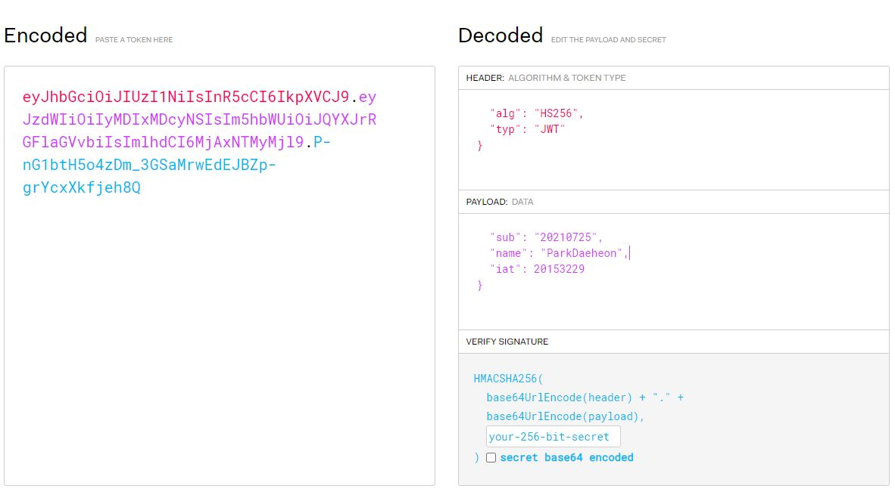

> ### 작성자 : 박대헌 
<br>

> #### [Redis](https://redis.io/)

- Remote Dictionary System 약자
  

- NoSQL DBMS로 볼수도 있고 , 인 메모리라는 특성에 때문에 In memory 솔루션으로 분류
  

- 인 메모리 원격 캐시 서버
  

- 즉 메모리를 이용하여 빠르게 <key, value> 스타일의 데이터를 저장하고 불러올 수 있는 원격 시스템

> #### Redis 사용법 
- redis-server process를 ip, port에 띄워놓고 접근해서 <key, value> 저장이후 사용


 
>#### Redis  특성 

- 관계형 또는 NoSQL 데이터베이스의 부담을 줄여줌 


- Redis 데이터는 서버의 주 메모리에 상주


- 빠른 **키 값 스토어**로 사용하면 간단하게 세션 정보 관리 가능


- Redis에서는 패턴 매칭과 더불어 **PUB/SUB** 표준을 지원


- Redis는 이벤트 속도를 측정하고 필요한 경우 제한가능


- 마스터-슬레이브 아키텍처를 사용


- Append Only File(AOF) 생성을 모두 지원 (스냅샷 , 데잉터 변경될때마다 디스크에 저장)


> #### [JWT](https://jwt.io/)
- Json 포맷을 이용하여 사용자에 대한 속성을 저장하는 Claim 기반의 Web Token 
 

- JWT는 토큰 자체를 정보로 사용하는 Self-Contained 방식


[ JWT 사진 ]



> #### JWT 특성

- Header, Payload, Signature의 3 부분

- 각 부분은 Base64로 인코딩

- 각각의 부분을 이어 주기 위해 ```.``` 구분자를 사용

> #### JWT Header

- 토큰의 헤더는 typ과 alg 두 가지 정보로 구성<br><br>
    + typ : 토큰 타입 지정 ex) **JWT**<br><br>
      
    + alg : 알고리즘 방식 지정 , 서명 및 토큰 검증에 사용한다. **ex) HS256(SHA256) 또는 RSA**
   

- alg는 헤더(Header)를 암호화 하는 것이 아니다  서명을 해싱하기 위한 알고리즘을 지정


> #### JWT PayLoad

- 토큰에서 사용할 정보의 조각들인 클레임이 담겨 있다.<br><br>

- 클레임은 총 3가지로 나누어 지며 Json 형태로 다수의 정보를 넣을 수 있다.

   + > ####  등록된 클레임(Registered Claim) 
      - 토큰 정보를 표현하기 위해 이미 정해진 종류의 데이터<br><br>
      - JWT를 간결하기 위해 key는 모두 길이 3의 String<br><br>
      - Subejct로는 unique한 값을 사용한다 (이메일이나 학번과 같은 값)<br><br>
          + iss: 토큰 발급자(issuer)<br><br>
          + sub: 토큰 제목(subject)<br><br>
          + aud: 토큰 대상자(audience)<br><br>
          + exp: 토큰 만료 시간(expiration), NumericDate 형식으로 되어 있어야 함 ex) 1480849147370<br><br>
          + nbf: 토큰 활성 날짜(not before), 이 날이 지나기 전의 토큰은 활성화되지 않음<br><br>
          + iat: 토큰 발급 시간(issued at), 토큰 발급 이후의 경과 시간을 알 수 있음<br><br>
          + jti: JWT 토큰 식별자(JWT ID), 중복 방지를 위해 사용하며, 일회용 토큰(Access Token) 등에 사용
  + > #### 공개 클레임(Public Claim)
     - 사용자 정의 클레임으로, 공개용 정보를 위해 사용 <br><br>
     -   충돌 방지를 위해 URI 포맷
      
      ```json
      { "https://mangkyu.tistory.com": true }
      ```
    <br>

  + > ####  비공개 클레임(Private Claim)
      - 사용자 정의 클레임으로, 서버와 클라이언트 사이에 임의로 지정한 정보를 저장<br><br>
    
      ```json
      "token_type": access 
     ```
    <br>


> #### JWT Signature

- 서명(Signature)은 토큰을 인코딩하거나 유효성 검증을 할 때 사용하는 고유한 암호화 코드


- 서명(Signature)은 위에서 만든 헤더(Header)와 페이로드(Payload)의 값을 각각 BASE64로 인코딩


- 인코딩한 값을 비밀 키를 이용해 헤더(Header)에서 정의한 알고리즘으로 해싱


- 이 값을 다시 BASE64로 인코딩하여 생성


### 로그인 흐름 

1. 유저가 로그인을 한다 

2. JWT이 존재 하는지 검사

3. JWT가 유효 한지 검사

4. 유효성 검사는 레디스에 만료시간이 존재하는 토큰과 같은지 비교

5. 토큰이 없다면 redirect


### 로그인 흐름 2 

1. 회원가입 DB저장

2. 로그인후 회원가입 확인후  JWT 토큰 생성  (A, B, C )
   - A :  로그인 이후에 redis에서 토큰 생성 할 것인가?
   - B :  채팅방을 개설 한 후에 토큰을 생성 할 것인가?


3. 인증이 필요한 로직마다 토큰 날림

4. 서버 토큰이 Redis에 존재하면 통과


