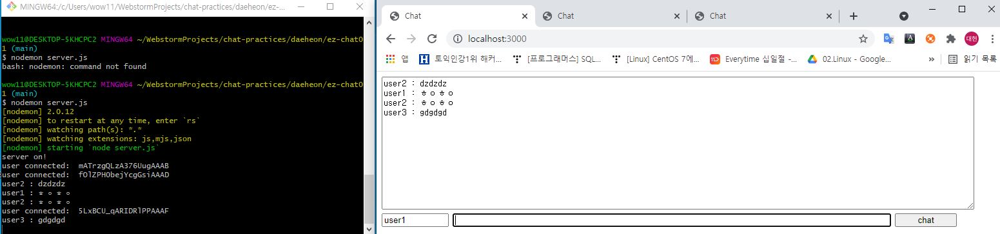

> ###NODE.JS 패킷 통신 방법

## Web Socket 

- 웹소켓은 웹 서버와 웹 브라우저 간의 양방향 통신을 위한 프로토콜


- 일반적으로 웹사이트는 요청(request)과 회신(response)로 작동


- 브라우저(클라이언트)에서 주소창에 주소를 입력하거나, 웹사이트의 링크를 클릭하거나 혹은 브라우저의 javascript에서 ajax 요청 등에 의해 request가 발생하는데 이 request가 서버로 전달되면 서버는 response를 만들어서 보내줌


- 서버는 클라이언트의 request 가 없으면 데이터를 전달하지 않는다. 항상 request가 클라이언트쪽에서 먼저 시작되고, 그 request에 대한 response만 전달됨


- ( **BUT** )  웹 소켓은 클라이언트와 서버의 연결을 항상 유지한다


-   연결이 유지된 상태에서 서버 혹은 클라이언트상의 event(이벤트)가 발생하면(triggered) event listener에 의해 서버에서 클라이언트로, 혹은 클라이언트에서 서버로 데이터의 전달이 이루어 진다.

    +   ### event listener란?
    
    - 웹사이트에서 버튼을 클릭하게 되면 'click'이라는 event가 발생
    
    -  event에 대한 코딩이 되어있어서 버튼을 누르면 form이 제출되거나 함수가 실행
    
    - event를 직접 만들 수도 있는데, 만약 그림이 클릭되는 경우 어떤 함수를 실행되게 하고 싶다면 직접 이 event를 코딩해야 한다.
    
    - **(결론)** event와 event가 발생하는 경우 어떤 일을 할지를 코딩하여 실행하게 되면, 이 코드는 event가 발생할 때까지 기다리는데, 이를 event listener라고 한다.


## Socket.IO

- Node 에서는 웹 소켓을 이용하기 위해 socket.io 를 이용한다.

- 클라이언트나 서버에서 socket.io를 이용하여 event를 발생시킬 수 있고 이 event는 서로에게 전달 된다.

- 그러면 반대편의 event listener가 이 event에 대한 반응을 하게 된다.

> ### 결론

- socket.io 에는 누군가 웹 사이트에 접속 하면 connection , 이탈하면 disconnect
등의 기본 event가 있다 
  
  
- 사용자 정의 event도 작성 할 수 있는데 예를들면 A라는 버튼을 누른다면 A Click의 이벤트에 대한 event listener를 작성 할수 있다.


- 반대로 서버에서 event를 발생 시킨 브라우저에 event listener를 작성하여 서버에서 브라우저로 데이터를 전송 할 수도 있다


- 이 때 서버에서 발생시키는 event는 특정한 클라이언트에서 전달 하게 할 수 도있고 접속된 모든 클라이언트들에게도 전달 가능 하게 된다.

 
> ### 채팅 흐름

1. A가 메시지를 전송한다 , Client 에게 'send!!' event를 메시지와 함께 서버로 전달

2. 서버에서 'send!!' event listener에서 event를 감지후 메시지 전달 받음

3. 서버의 'send!!' event listener가 'receive!!' event를 메시지와 함께 접속중인 모든 클라이언트에게 보낸다.

4. 접속중인 모든 클라이언트의 'receive!!' event listener가 event를 감지 하고 메시지를 받음

5. 클라이언트들의 'receive!!' event listener가 메시지를 화면 표시


```
< -D 로 설치하면 작동이 안됨> 
npm init -y

npm i express socket.io
npm i nodemon
```


